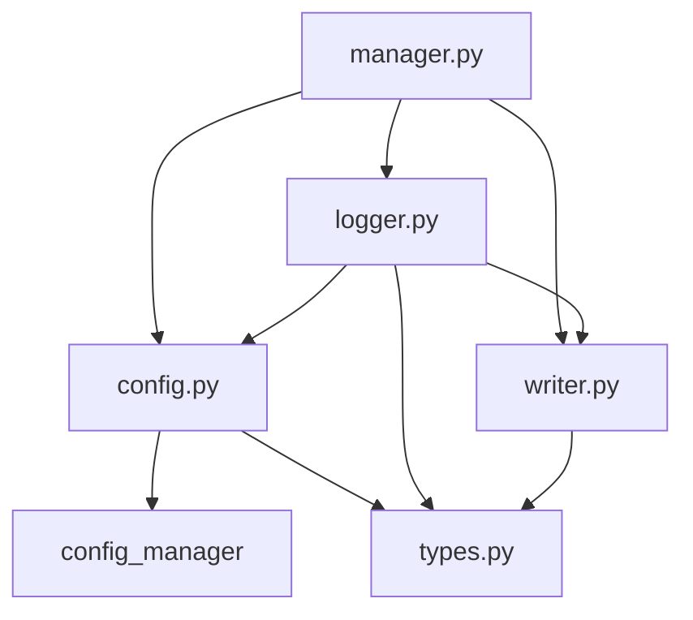
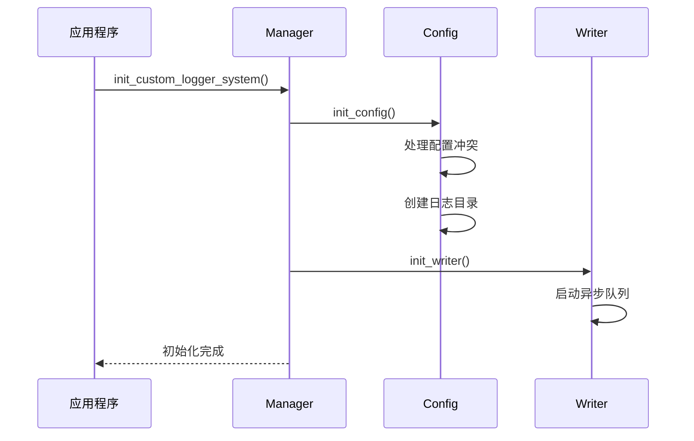
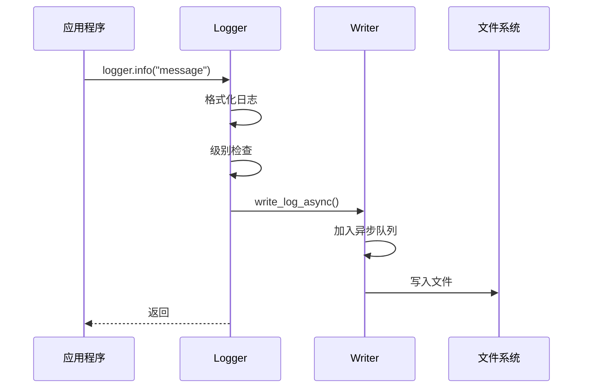
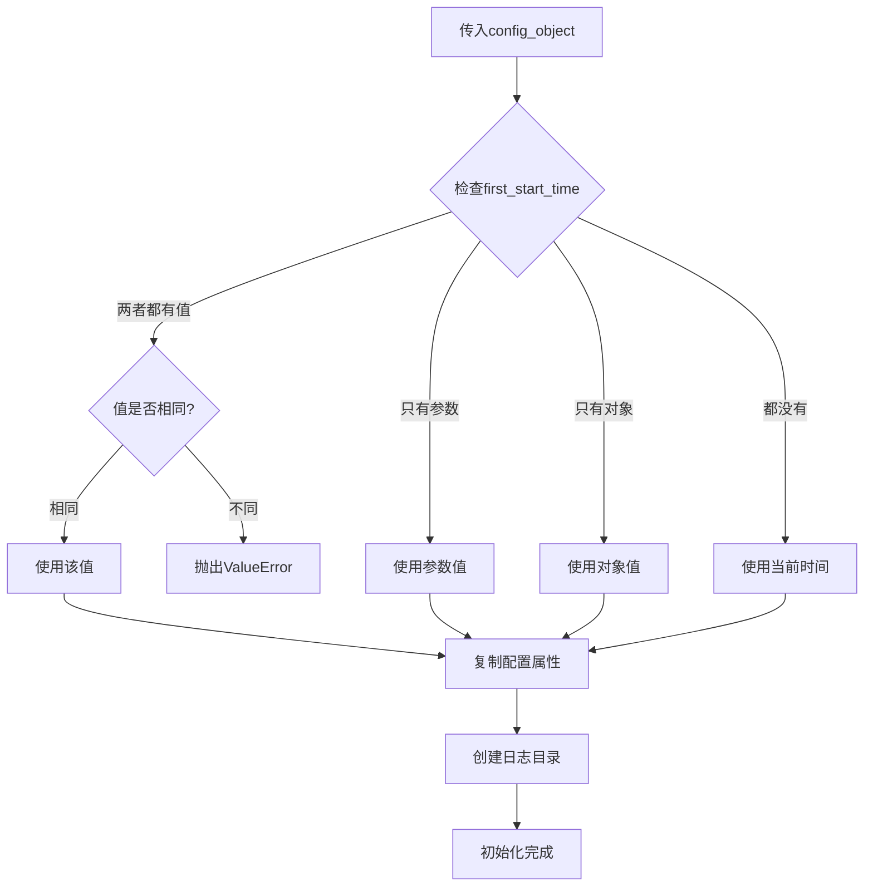
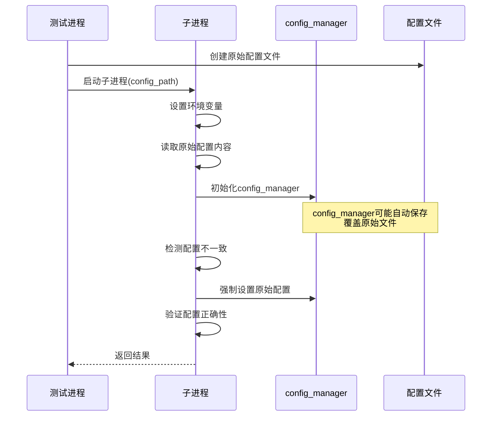

# Custom Logger 架构设计文档

## 1. 引言

### 1.1 目的
本文档描述了custom_logger项目的整体架构设计，包括系统组件、模块划分、数据流向以及关键设计决策。

### 1.2 适用范围
本文档适用于custom_logger项目的开发、维护和扩展工作。

### 1.3 系统概述
custom_logger是一个高性能、可配置的Python日志系统，支持异步写入、多级别日志、路径管理和灵活的配置方式。系统经过多次迭代优化，现已支持多进程环境下的配置隔离、config_manager集成的稳定性增强，以及配置文件的智能加载机制。系统采用ruamel.yaml作为YAML处理库，提供更好的格式保持能力和安全的序列化机制。

**最新架构变更（2025年1月）**：
- 日志目录管理从 `config.logger.current_session_dir` 迁移到 `config.paths.log_dir`
- 集成 `is_debug` 模块进行调试模式检测
- 优化日志目录生成规则：`base_dir\{debug}\{项目名}\{实验名}\{日期yyyy-mm-dd}\{时间HHMMSS}`
- **新API设计**：`init_custom_logger_system`不再调用config_manager，直接接收config对象
- **Worker支持**：新增`init_custom_logger_system_for_worker`专门用于worker进程初始化
- **严格验证**：`get_logger`名字长度限制为8个字符，超过直接抛出异常
- **队列模式**：支持多进程队列模式，主程序负责文件写入，worker负责日志生成

## 2. 架构概览

### 2.1 整体架构
custom_logger采用分层架构设计，主要包含以下层次：

```
┌─────────────────────────────────────────────────────────────┐
│                    应用层 (Application Layer)                │
│  ┌─────────────────┐  ┌─────────────────┐  ┌──────────────┐ │
│  │   主程序调用     │  │   Worker进程     │  │   测试用例   │ │
│  └─────────────────┘  └─────────────────┘  └──────────────┘ │
└─────────────────────────────────────────────────────────────┘
                              │
┌─────────────────────────────────────────────────────────────┐
│                    接口层 (Interface Layer)                  │
│  ┌─────────────────────────────────────────────────────────┐ │
│  │              manager.py (系统管理接口)                   │ │
│  │  init_custom_logger_system() / get_logger()            │ │
│  └─────────────────────────────────────────────────────────┘ │
└─────────────────────────────────────────────────────────────┘
                              │
┌─────────────────────────────────────────────────────────────┐
│                    核心层 (Core Layer)                       │
│  ┌──────────────┐  ┌──────────────┐  ┌──────────────────┐   │
│  │ logger.py    │  │ config.py    │  │ writer.py        │   │
│  │ (日志记录器)  │  │ (配置管理)   │  │ (异步写入器)      │   │
│  └──────────────┘  └──────────────┘  └──────────────────┘   │
└─────────────────────────────────────────────────────────────┘
                              │
┌─────────────────────────────────────────────────────────────┐
│                   支撑层 (Support Layer)                     │
│  ┌──────────────┐  ┌──────────────┐  ┌──────────────────┐   │
│  │ types.py     │  │ config_mgr   │  │ 文件系统         │   │
│  │ (类型定义)    │  │ (外部依赖)   │  │ (日志存储)        │   │
│  └──────────────┘  └──────────────┘  └──────────────────┘   │
└─────────────────────────────────────────────────────────────┘
```

### 2.2 核心组件

#### 2.2.1 Manager (管理器)
- **职责**: 系统初始化、生命周期管理、logger实例创建
- **关键功能**: 
  - 系统初始化和清理
  - 配置对象处理和验证
  - Logger实例工厂

#### 2.2.2 Config (配置管理)
- **职责**: 配置加载、验证、管理
- **关键功能**:
  - 多种配置源支持（文件、对象）
  - 配置冲突检测和解决
  - 会话目录管理
  - 多进程环境配置隔离
  - config_manager集成优化
  - 原始配置文件保护机制

#### 2.2.3 Logger (日志记录器)
- **职责**: 日志记录、格式化、级别控制
- **关键功能**:
  - 多级别日志记录
  - 调用链追踪
  - 异步写入调度

#### 2.2.4 Writer (异步写入器)
- **职责**: 异步日志写入、文件管理
- **关键功能**:
  - 异步队列处理
  - 文件轮转和管理
  - 性能优化

## 3. 模块设计

### 3.1 模块依赖关系



### 3.2 关键模块详细设计

#### 3.2.1 manager.py
```python
# 核心接口
def init_custom_logger_system(
    config_path: Optional[str] = None,
    first_start_time: Optional[datetime] = None,
    config_object: Optional[Any] = None
) -> None

def get_logger(
    name: str,
    console_level: Optional[str] = None,
    file_level: Optional[str] = None
) -> CustomLogger

def tear_down_custom_logger_system() -> None
```

**设计要点**:
- 单例模式管理全局状态
- 支持多种初始化方式
- 自动清理资源

#### 3.2.2 config.py
```python
# 核心配置处理
def init_config(
    config_path: Optional[str] = None,
    first_start_time: Optional[datetime] = None,
    config_object: Optional[Any] = None
) -> None

def _init_from_config_object(
    config_object: Any,
    first_start_time: Optional[datetime] = None
) -> None
```

**设计要点**:
- 配置优先级管理
- 冲突检测和解决
- 日志目录自动创建（从paths.log_dir管理）
- 集成is_debug模块进行调试模式检测

#### 3.2.3 logger.py
```python
class CustomLogger:
    def __init__(self, name: str, console_level: Optional[int], file_level: Optional[int])
    def debug(self, message: str) -> None
    def info(self, message: str) -> None
    def warning(self, message: str) -> None
    def error(self, message: str) -> None
    def critical(self, message: str) -> None
```

**设计要点**:
- 标准日志接口
- 级别控制
- 异步写入集成

## 4. 数据流设计

### 4.1 初始化流程



### 4.2 日志记录流程



### 4.3 配置对象处理流程



### 4.4 多进程配置加载流程



## 5. 技术选型

### 5.1 YAML处理库选择

#### 5.1.1 ruamel.yaml vs PyYAML
- **决策**: 选择ruamel.yaml作为YAML处理库
- **理由**: 
  - **格式保持**: ruamel.yaml能够保持YAML文件的原始格式，包括注释、空行和缩进
  - **安全性**: 避免PyYAML的不安全序列化问题，防止任意Python对象执行
  - **功能丰富**: 支持更多YAML 1.2规范特性
  - **维护活跃**: 有更活跃的维护和定期更新
- **实现**: 
  ```python
  from ruamel.yaml import YAML
  yaml = YAML()
  yaml.preserve_quotes = True
  yaml.default_flow_style = False
  ```

#### 5.1.2 配置文件处理优势
- **格式保持**: 配置文件在自动保存后仍保持良好的可读性
- **注释保留**: 支持在配置文件中保留注释信息
- **类型安全**: 更严格的类型检查和转换
- **Unicode支持**: 更好的Unicode字符处理能力

### 5.2 依赖管理
- **核心依赖**: ruamel.yaml >= 0.17.0
- **外部集成**: config_manager（项目特定配置管理器）
- **标准库**: 充分利用Python标准库，减少外部依赖

## 6. 关键设计决策

### 6.1 配置管理设计

#### 6.1.1 多配置源支持
- **决策**: 支持配置文件、配置对象、参数三种配置源
- **理由**: 满足不同使用场景的需求
- **实现**: 优先级机制和冲突检测

#### 6.1.2 first_start_time冲突处理
- **决策**: 相同值不冲突，不同值抛出错误
- **理由**: 避免歧义，提供明确的错误信息
- **实现**: 智能比较算法，支持多种时间格式

#### 6.1.3 多进程配置隔离
- **决策**: 在多进程环境中保护原始配置文件内容
- **理由**: 防止config_manager自动保存覆盖测试配置
- **实现**: 预读原始配置，强制设置到config_manager

#### 6.1.4 config_manager集成优化
- **决策**: 智能检测配置不一致并自动修复
- **理由**: 确保多进程环境下配置的正确性
- **实现**: 配置内容比较和强制更新机制

### 6.2 异步写入设计

#### 6.2.1 异步队列
- **决策**: 使用异步队列处理日志写入
- **理由**: 提高性能，避免阻塞主线程
- **实现**: 基于asyncio的队列机制

#### 6.2.2 错误处理
- **决策**: 遇错即抛原则
- **理由**: 快速失败，便于问题定位
- **实现**: 最小化try-except使用

### 6.3 模块化设计

#### 6.3.1 职责分离
- **决策**: 每个模块职责单一明确
- **理由**: 提高可维护性和可测试性
- **实现**: 清晰的接口定义和依赖关系

#### 6.3.2 依赖注入
- **决策**: 通过参数传递依赖关系
- **理由**: 降低耦合度，便于测试
- **实现**: 函数参数和配置对象

## 7. 性能考量

### 7.1 异步处理
- 日志写入采用异步队列，避免I/O阻塞
- 批量写入优化，减少系统调用

### 7.2 内存管理
- 及时释放不需要的对象
- 避免循环引用

### 7.3 文件操作
- 合理的文件缓冲策略
- 文件轮转和清理机制

### 7.4 多进程性能优化
- 配置预读机制，减少重复I/O操作
- 智能配置检测，避免不必要的更新
- 环境变量传递，减少进程间通信开销

### 7.5 YAML处理性能
- ruamel.yaml的高效解析和序列化
- 格式保持功能不影响处理速度
- 内存友好的流式处理支持

## 8. 扩展性设计

### 8.1 插件机制
- 预留日志处理器扩展点
- 支持自定义格式化器

### 8.2 配置扩展
- 支持新的配置源类型
- 动态配置更新机制

### 8.3 输出扩展
- 支持多种输出目标
- 网络日志传输支持

## 9. 安全考量

### 9.1 敏感信息保护
- 配置文件中禁止硬编码敏感信息
- 日志内容脱敏处理

### 9.2 文件权限
- 合理的日志文件权限设置
- 防止未授权访问

### 9.3 资源限制
- 日志文件大小限制
- 内存使用监控

### 9.4 YAML安全性
- 使用ruamel.yaml避免不安全的Python对象反序列化
- 禁止加载包含`!!python/object`标签的YAML内容
- 配置文件内容验证和清理

## 10. 部署架构

### 10.1 开发环境
- Windows 10
- Python 3.12+
- 本地文件系统

### 10.2 生产环境
- 支持跨平台部署
- 高性能存储系统
- 监控和告警机制

### 10.3 容器化支持
- Docker镜像构建
- 配置外部化
- 日志卷挂载

## 11. 测试架构设计

### 11.1 测试隔离架构

#### 11.1.1 路径隔离策略
- **系统临时路径使用**: 所有测试必须使用`tempfile.gettempdir()`获取系统临时目录
- **生产路径禁用**: 严禁在测试中使用d:\根目录等生产环境路径
- **测试数据隔离**: 每个测试用例使用独立的临时目录空间

#### 11.1.2 Mock配置架构
- **具体值设置**: Mock对象的关键属性（base_dir、experiment_name等）必须设置为具体字符串值
- **路径格式一致性**: Mock配置生成的路径格式必须与实际实现保持一致
- **属性完整性**: Mock配置必须包含业务逻辑所需的所有必要属性

### 11.2 测试数据管理

#### 11.2.1 路径格式标准化
- **实际路径格式**: `{base_dir}\{project_name}\{experiment_name}\{YYYY-MM-DD}\{HHMMSS}`
- **日期格式标准**: 使用`YYYY-MM-DD`格式，不使用`YYYYMMDD`或包含`logs`目录的格式
- **测试期望对齐**: 所有测试期望值必须与实际实现的路径格式完全一致

#### 11.2.2 Mock配置标准化
```python
# 标准化Mock配置创建模式
import tempfile
temp_dir = tempfile.gettempdir()
mock_cfg = MagicMock()
mock_cfg.base_dir = temp_dir  # 使用系统临时路径
mock_cfg.experiment_name = "default"  # 具体字符串值
mock_cfg.first_start_time = "2024-01-01T12:00:00"  # ISO格式
mock_cfg.logger = {"global_console_level": "info"}  # 字典对象
mock_cfg.paths = {"log_dir": temp_dir}  # 路径配置
```

### 11.3 测试配置管理
- **配置对象验证**: 确保Mock配置对象支持JSON序列化和数学运算
- **环境隔离**: 测试环境与生产环境完全隔离，避免相互影响
- **清理机制**: 测试结束后自动清理临时文件和目录

## 12. 监控和运维

### 12.1 健康检查
- 系统初始化状态检查
- 异步队列状态监控
- 文件写入状态检查

### 12.2 性能监控
- 日志写入延迟监控
- 队列长度监控
- 文件I/O性能监控

### 12.3 故障恢复
- 自动重试机制
- 降级处理策略
- 故障隔离设计

---

## 文档维护

**创建日期**: 2025-06-06  
**最后更新**: 2025-06-06  
**版本**: v1.2  
**维护者**: 开发团队  

### 更新记录
- v1.3 (2025-06-06): 新增测试架构设计，包含路径隔离策略和Mock配置标准化
- v1.2 (2025-06-06): 新增技术选型章节，详细说明ruamel.yaml的选择和优势
- v1.1 (2025-06-06): 新增多进程配置管理和config_manager集成优化的架构设计
- v1.0 (2025-06-06): 初始版本，包含config_object初始化优化的架构设计 